# 🎉 MultiAgent-LangChain Project 🚀

Welcome to the **MultiAgent-LangChain** project! This repository is designed to harness the power of multiple AI agents working in tandem to solve complex problems in various domains, from data analysis to web searching and fact-checking. Here's a breakdown of the project and its components.

```mermaid

graph TD;
    A[MultiAgent-LangChain Project] --> B[Directory Structure]
    A --> C[Getting Started]
    A --> D[Key Features]
    A --> E[Documentation]
    A --> F[Contributing]
    A --> G[Contact]

    B --> B1[assets/]
    B --> B2[data/]
    B --> B3[docs/]
    B --> B4[src/]
    B --> B9[app.py]
    B --> B10[main.py]
    B --> B11[tests/]
    B --> B12[.env]
    B --> B13[poetry.lock & pyproject.toml]
    B --> B14[README.md]

    B4 --> B5[multiagent_langchain/]
    B4 --> B6[notebooks/]
    B4 --> B7[src/features/]
    B4 --> B8[src/models/]
    B4 --> B9[src/utils/]

    C --> C1[Install Dependencies]
    C --> C2[Set Environment Variables]
    C --> C3[Run Application]

    D --> D1[Multi-Agent Architecture]
    D --> D2[Modular Design]
    D --> D3[Advanced NLP]
    D --> D4[Cross-Domain Functionality]

    E --> E1[docs/ directory]
    E --> E2[Online Documentation]

    F --> F1[Contribute via GitHub]
    F --> F2[Check CONTRIBUTING.md]

    G --> G1[Email]
    G --> G2[GitHub Issues]
```




## 📁 Directory Structure

- **assets/** 📦: Contains all the static assets required for the project.
- **data/** 📊: This directory holds datasets used for analysis and model training.
- **docs/** 📚: Documentation and guides related to the project.
- **models/** 🤖: Pre-trained and custom models used in the project.
- **multiagent_langchain/** 🧠: Core logic of the project, including agent definitions and utilities.
- **notebooks/** 📓: Jupyter notebooks for experimenting with and demonstrating the project capabilities.
  - `demoMultiAgent.ipynb` 📝: A demonstration notebook showcasing the functionalities of multiple agents.
- **features/** ⚙️: Contains specific feature implementations.
  - `data_analysis_tool.py` 🔍: Tools and functions for performing data analysis.
  - `fact_check_tool.py` 🕵️: A tool designed for fact-checking using AI agents.
  - `math_tool.py` ➗: A tool for performing complex mathematical computations.
  - `news_tool.py` 📰: Scrapes and analyzes news articles.
  - `nip_tool.py` 🔒: Implements Network Information Processing functions.
  - `web_search_tool.py` 🌐: A tool for web searches using various APIs.
  - `wikipedia_tool.py` 🧑‍💻: Fetches and processes information from Wikipedia.
- **models/** 🤖: Contains machine learning models and input models.
  - `input_models.py` 📥: Handles the input model architecture.
- **utils/** 🛠️: Utility scripts and functions.
  - `environment_setup.py` 🌱: Script for setting up the environment.
  - `evaluation_metrics.py` 📈: Defines and computes evaluation metrics for models and tools.
  - `language_model.py` 💬: Core language model configurations and management.
  - `prompt_setup.py` 💡: Handles the setup and configuration of prompts used by agents.
- **app.py** 🖥️: Entry point for the application.
- **main.py** ⚙️: The main script that orchestrates the interactions between different agents.
- **tests/** 🧪: Unit and integration tests for ensuring code reliability.
- **.env** 🔑: Environment variables required for the project.
- **poetry.lock & pyproject.toml** 📦: Dependency management files.
- **README.md** 📄: You're reading it!

## 🚀 Getting Started

To get started with the project, ensure that you have the required dependencies installed. You can do this by running:

```bash
poetry install
```

Next, set up your environment variables by copying `.env.example` to `.env` and filling in the required fields.

Finally, you can run the main application using:

```bash
python main.py
```

🎯 Key Features
- **Multi-Agent Architecture**: Combines the power of multiple AI agents to tackle different tasks such as data analysis, fact-checking, and web searching.
- **Modular Design**: Each tool and agent is modular, allowing easy updates and integration of new features.
- **Advanced NLP**: Utilizes state-of-the-art language models to process and understand complex queries.
- **Cross-Domain Functionality**: Capable of handling tasks across various domains, from mathematical computations to scraping the web for the latest news.

📖 Documentation
For detailed documentation, please refer to the `docs/` directory or visit our [online documentation](#).

🤝 Contributing
We welcome contributions! Feel free to fork this repository, submit pull requests, and report issues. For more detailed guidelines, check out our `CONTRIBUTING.md` in the `docs/` directory.

📬 Contact
If you have any questions or need further assistance, feel free to reach out via email or open an issue on GitHub.

Happy Coding! 🎉
